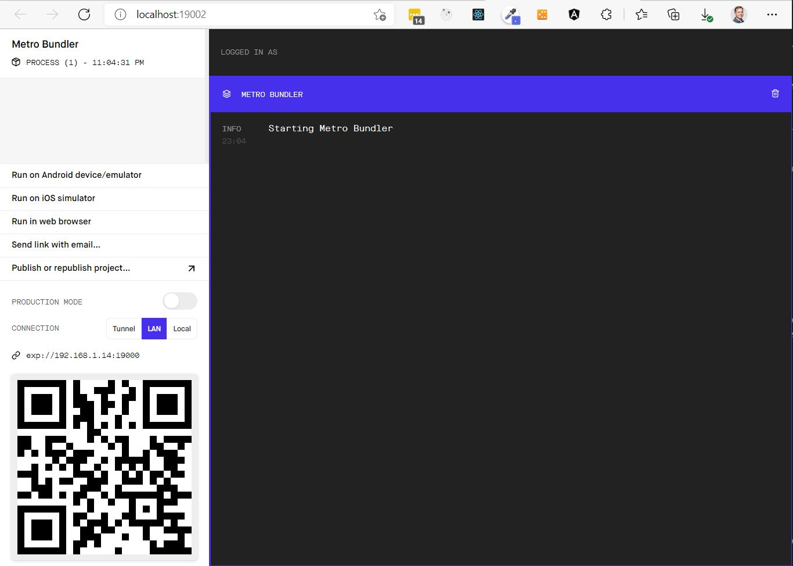

# React Native Sample App
## CLI
There are two CLI tools you can use when creating your React Native App.
- Expo CLI
- React Native CLI

### Expo CLI
Expo adds a thin layer around the React Native framework which exposes a simpler API for developers to work with, especially when it comes to  integrating with a devices native components, like the camera.

[Expo - Getting Started](https://docs.expo.dev/get-started/installation/)


### React Native CLI
You will be responsible for add each module required for integrating with device native components, but you have more granularity over how you can integrate with the component.

It does add complexity, so only use this if you know you'll need specialised functionality in your solution.
[Reactive Native Introduction](https://reactnative.dev/docs/getting-started)

# Create a new React Native application
We will be using Expo CLI, since the applications we are building don't have any specialised functionality.

## Install Expo CLI
First you need to make sure you have the Expo CLI installed on your workstation.

```sh
npm install -g expo-cli
```


## Create your React Native application
Once you have the Expor CLI tools installed, you can create your first React Native application.  Browse to the root folder where you want your new React Native project folder to live, then simply run the following Expo CLI command:

### Using NPM
```sh
expo init app-name  --npm
```

### Using Yarn (If you have Yarn installed)
```sh
expo init app-name
```
**Please Note:** If Yarn is installed, it will use Yarn by default!


## Start using Expo DevTools
Assuming you used NPM to create your new app, you can start the app with the Expo DevTools with the following command:

```sh
npm start
```

This will open up the Expo DevTools in a browser window:


## Running it on your device
You probably noticed that the Expo devtools has an QR code image on it's home page.  How do you use this?  Well, it's actually quite simple.  If you want to run the application on either your iOS or Android device, simply install the **Expo Go** or **Expo Client** application from the App Store or Google Play Store.  

On the Expo DevTools, you have three options to choose from to connect to your debug instance of the app:
- Tunnel
- LAN
- Local

I could only get it to work using Tunnel!  But it's quick and if you change anything in your app, it updates on your mobile device instantaniosly!!


# Disadvantages of using React Native Apps
Even building React Native apps gives you a performance boost, since it compiles your code's UI elements to native UI components, you are still responsible to make the components _look_ native :-(

 - Learn once, write everywhere

Reactive is a lot more bare bone compared to other frameworks like Ionic and Flutter.

## Fast moving target
- You get new versions every month
- Breaking changes happen
- High dependencies on third-party packages (that also change)
  - Luckily Expo removes this problem from you mostly, since it integrates with most native mobile components already!
- Bugs / Workarounds required

# Comparison between Mobile development frameworks
The following article compares three popular mobile development frameworks
- React Native
- Flutter
- Ionic
- Nativescript
- PWA

[Mobile Dev Frameworks Comparison](https://academind.com/tutorials/react-native-vs-flutter-vs-ionic-vs-nativescript-vs-pwa)

# Git SSH authentication using a differnt public key

To use a specific SSH Key (in case you have multiple SSH keys on your system), configure your local Git repo with the following command

```sh
git config core.sshCommand "ssh -i ~/.ssh/id_rsa_example -F /dev/null"
```
